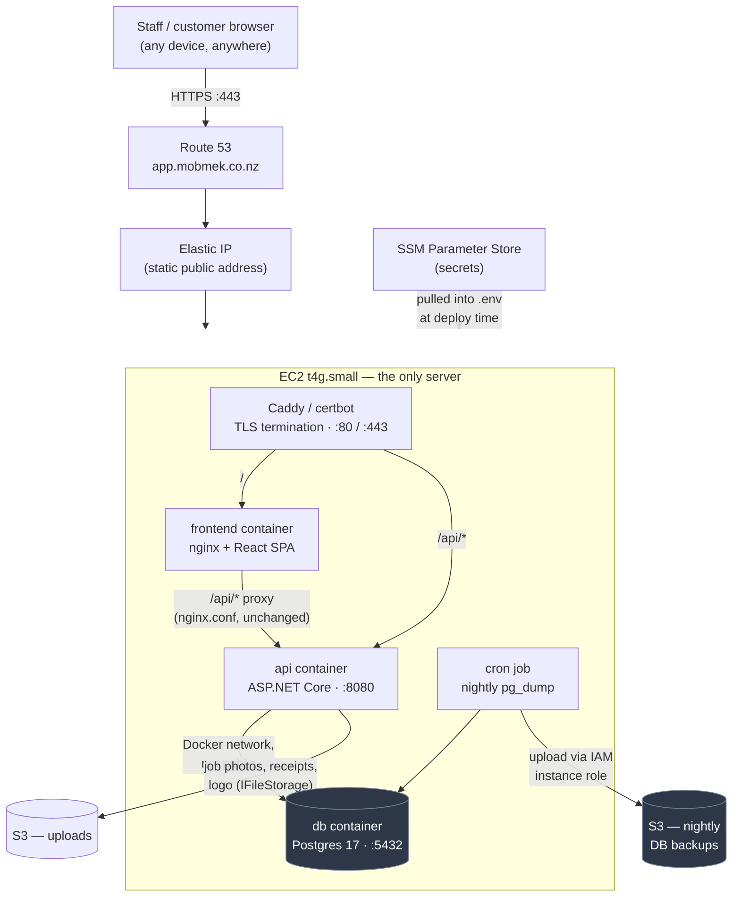
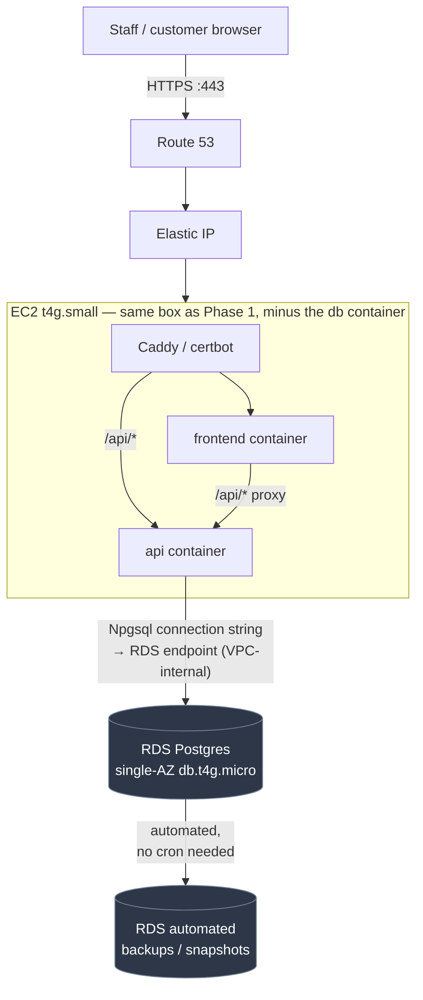
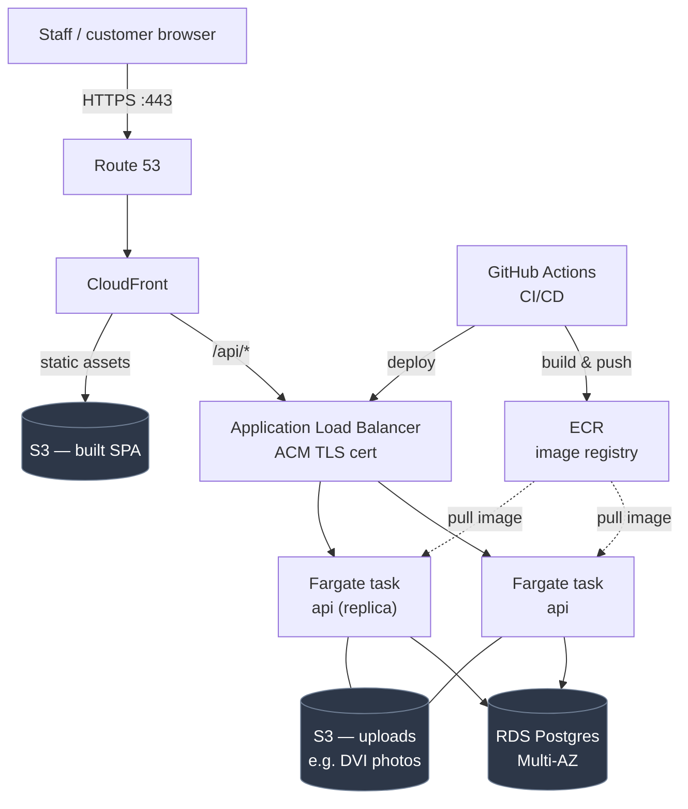

# Infrastructure — AWS deployment plan

Plan for taking Mobmek from local Docker Compose to a live AWS deployment, written for a
single-shop SMB budget. Nothing here is provisioned yet — this is the plan to execute against,
and the checklist doubles as a punch list.

**Which phase do you actually need? Phase 1, right now — that's it.** Phase 1 is a complete,
real production deployment: staff and customers reach it from any device over the internet like
any normal website, at ~$19–23/month. "Growth path" below is a reference menu for *later*, each
item adopted independently and only when a specific trigger happens — it is not a second
deployment you also need to set up today, and adopting one item from it doesn't require adopting
the rest.

The guiding rule: **use the cheapest AWS service that meets the actual requirement, not the
"proper" one.** A single EC2 box running the exact same `docker-compose.yml` this repo already
has, backed up to S3, is a legitimate production setup at this scale — not a shortcut to be
embarrassed about. Most of what makes AWS expensive (ALB, NAT Gateway, RDS Multi-AZ, Fargate)
solves problems a one-shop system doesn't have yet.

Region: **ap-southeast-6 (Asia Pacific — New Zealand, Auckland)**. AWS launched this region in
2026 — it's a real, fully available region (confirmed live via the AWS API: 3 availability zones,
no opt-in required), not the Sydney workaround this doc originally assumed before that existed.
Using it means data stays in-country and latency to the shop is minimal.

## Cost summary — every option, one table

Numbers marked ✓ below were pulled live from the AWS Pricing API for this account in
ap-southeast-6 (Aug 2026) — the rest are estimates (AWS doesn't expose every service's pricing
via that API cleanly) and worth double-checking on the [AWS Pricing Calculator](https://calculator.aws)
before committing real money.

Everything below Phase 1 is optional and only added if/when its trigger happens (see each
section for the trigger). "Total" is the full monthly bill if you had *only* that row's changes
on top of Phase 1 — rows don't stack with each other unless stated.

| Setup | What's running | Total /month (USD) |
|---|---|---|
| **Phase 1 (do this now)** | Everything on 1 EC2 box | **~$19–23** |
| Phase 1 + RDS single-AZ | EC2 (frontend+api) + RDS for the DB | ~$36–42 |
| Phase 1 + RDS Multi-AZ | Same, with DB failover | ~$54–62 |
| Everything (Fargate+ALB+RDS+CloudFront+CI/CD) | Full "standard" AWS shape, no EC2 at all | ~$69–85 (single-AZ RDS) to ~$93–100 (Multi-AZ RDS) |

Full breakdown of each row is in "Growth path" further down.

---

## Phase 1 — minimum viable production (set this up now)

One EC2 instance runs the *same* `docker-compose.yml` already in this repo (db + api + frontend
containers) — no architecture change from local dev, which is exactly what keeps this cheap and
easy to reason about.

### How it connects

Everything — web server, API, database — lives in containers on **one box**. The only things
public are ports 80/443; Postgres and the API's raw port never leave the Docker network, same as
local dev today. SSH (22) is restricted to your own IP for admin access only — it's not how
anyone *uses* the app (see the earlier point: end users never touch the server directly, they
just hit the domain in a browser).

### What to provision

| Piece | Service | Notes |
|---|---|---|
| Compute | **EC2**, 1x `t4g.small` (Graviton/arm64, 2 vCPU/2GB) | Amazon Linux 2023 or Ubuntu 24.04 + Docker + Compose plugin. arm64 is ~20% cheaper than x86 and the Dockerfiles' base images (`.NET`, `node`, `nginx`, `postgres`) all publish arm64 builds. |
| Public IP | **Elastic IP** | Free while attached to a running instance. Static IP for DNS. |
| Storage | **EBS gp3**, 30GB | Root volume + Postgres data volume. |
| DNS | **Route 53** hosted zone | A record → Elastic IP. |
| TLS | **Caddy** (reverse-proxied in front of the existing nginx container) or **certbot** | Free Let's Encrypt certs, no ACM/ALB needed for a single box. |
| Backups | **S3** bucket, versioned, lifecycle → Glacier Instant Retrieval after 30 days | Nightly `pg_dump` from a cron job on the box. This is the fix for the "no backup/DR" gap flagged as highest-priority in `docs/industry-readiness-gap-analysis.md` §6.1 — do this first, before anything else here. |
| Uploads | **S3** bucket, versioned, private, no Glacier transition | Job photos, transaction receipts, business logo via `IFileStorage`. Separate from backups so the instance role can delete uploads without being able to delete backups. See "File storage" below. |
| Secrets | **SSM Parameter Store** (Standard tier, free) | Holds `RESEND_API_KEY`, `GOOGLE_CALENDAR_CREDENTIALS_JSON`, `POSTGRES_PASSWORD`, etc. Pulled into `.env` at deploy time instead of hand-copied. |
| IAM | One instance role (S3 backup bucket + SSM read only), one admin IAM user with MFA | Never use root account keys day-to-day. |
| Monitoring | **CloudWatch** basic EC2 metrics (CPU/disk/status checks) | Free tier alarms. Skip CloudWatch Logs agent for now — `docker compose logs` is enough at one shop's traffic, and log ingestion is billed per GB. |
| Budget guardrail | **AWS Budgets** alert at ~$25/mo | Free. Catches a misconfigured resource before it becomes a surprise bill. |

**Security group:** only 80/443 open to the world, 22 (SSH) restricted to your own IP(s). Postgres
(5433 in local compose) and the API's raw 8080 are **not** exposed publicly — nginx is still the
only public entry point, proxying `/api` internally exactly like it does today.

### Rough monthly cost (ap-southeast-6, USD)

This is **one EC2 instance** — on-demand billing, paid by the hour, no commitment. (Reserved/1-yr
pricing — cheaper but locks you in — isn't offered yet in this region as of Aug 2026: checked
live via the AWS Pricing API and it returns zero reserved-term offers here, presumably because
it's a newly launched region. Revisit that option later; it may appear over time.)

| Item | Cost | Source |
|---|---|---|
| EC2 t4g.small — on-demand | ~$16 | ✓ AWS Pricing API |
| EBS gp3 30GB | ~$3 | ✓ AWS Pricing API |
| Elastic IP (attached) | $0 | AWS pricing docs |
| S3 backups (<5GB) | <$1 | Estimate |
| Route 53 hosted zone | ~$0.50 + $0.40/million queries | AWS pricing docs (global, not region-specific) |
| Data transfer out | first 100GB/mo free, then ~$0.09–0.12/GB | Estimate |
| **Total** | **~$19–23/month** | |

**Exact resources to provision for this specific account/instance — see
[`infrastructure/docs/phase-1-plan.md`](docs/phase-1-plan.md).**

---

## What we're deliberately NOT doing in Phase 1 (cost discipline)

- **No RDS.** Postgres in the same Compose stack on the EC2 box, backed up nightly to S3, is fine
  at this scale and saves ~$19/mo over a single-AZ `db.t4g.micro` (~$38/mo over Multi-AZ).
- **No ALB / ECS / Fargate.** One box running the Compose file already tested locally is the same
  shape in prod — no new orchestration layer to learn or pay for.
- **No CloudFront.** The nginx container already serves the SPA fine at this traffic volume.
- **No NAT Gateway.** Default VPC, public subnet, one instance — a NAT Gateway alone is ~$32/mo
  for a private-subnet pattern this deployment doesn't need.
- **No Secrets Manager.** $0.40/secret/month adds up for no benefit over SSM Parameter Store
  Standard tier, which is free and does the same job here.
- **No ECR.** Building the image directly on the box (`docker compose up -d --build`) is simpler
  and free; only worth it once there's CI doing the build elsewhere (Growth path).

## Services checklist (Phase 1)

- [x] AWS account + AWS Budgets alert (~$25/mo threshold)
- [x] Limited instance role (`mobmek-prod-ec2-role`: both S3 buckets + SSM read only)
- [ ] IAM admin user with MFA (currently assuming `OrganizationAccountAccessRole` from `jun-dev`)
- [x] EC2 `t4g.small` in the default VPC, Docker + Compose plugin installed
- [x] Elastic IP attached to the instance (`3.102.246.171`)
- [x] Security group: 22 (your IP only), 80, 443 — nothing else public
- [ ] Route 53 hosted zone + A record → Elastic IP
- [ ] TLS via Caddy or certbot
- [x] S3 bucket (versioned, lifecycle → Glacier IR @ 30d, block public access) for DB backups
- [x] S3 bucket for uploads (versioned, private, no Glacier transition) + `FileStorage:Provider=S3`
- [ ] Nightly cron: `pg_dump` → upload to S3, via the instance role (scoped to that bucket only)
- [ ] A tested **restore** drill, not just a backup script — untested backups aren't backups
- [x] SSM Parameter Store entries for the secrets currently in `.env.example`
- [ ] `ASPNETCORE_ENVIRONMENT=Production` set (dev auto-migrates + exposes Swagger; prod must not)
- [x] A way to *run* EF Core migrations in prod — `scripts/generate-migration-script.sh` (see
      `docs/phase-1-plan.md` → "Running migrations in production")

## Deploy flow (Phase 1, manual — no CI/CD yet)

1. SSH to the instance.
2. `git clone`/`git pull` this repo.
3. Pull secrets from SSM into `.env` (or hand-maintain `.env`, root-only permissions — acceptable
   at this scale as long as it's never committed).
4. Set `ASPNETCORE_ENVIRONMENT=Production` and `FRONTEND_BASE_URL` to the real domain.
5. Set `FILE_STORAGE_PROVIDER=S3` and `FILE_STORAGE_S3_BUCKET` — on the **first** deploy, also
   `aws s3 sync ./uploads s3://mobmek-uploads-649058763120/` first, or existing photo/receipt rows
   will point at objects that don't exist.
6. `docker compose up -d --build`.
7. Run pending migrations as a separate step (production does not auto-migrate on startup):
   `./scripts/generate-migration-script.sh` locally, then `scp` + `psql` on the box — see
   `docs/phase-1-plan.md` → "Running migrations in production" for the exact commands.
8. Verify `https://<domain>` loads, that Swagger is **not** reachable, and that uploading a job
   photo then reloading the page still shows it (proves the S3 path, not local disk, is live).

---

## File storage / S3 for uploads (not backups)

This is now live, not deferred — the job-photos feature shipped (migration `AddJobPhotos`,
closing gap 2.1 in `docs/industry-readiness-gap-analysis.md`), and `IFileStorage` has two
implementations: `LocalFileStorage` (development default) and `S3FileStorage` (production). Both
derive keys from the same `StorageKeys` helper, so a key stored in the database is valid against
either backend and switching provider rewrites nothing.

**This deployment therefore uses two buckets, not one:**

| Bucket | Holds | Lifecycle |
|---|---|---|
| `mobmek-backups-649058763120` | nightly `pg_dump` output | → Glacier IR at 30d; noncurrent versions expire at 90d |
| `mobmek-uploads-649058763120` | job photos, transaction receipts, business logo | stays in Standard (read interactively); noncurrent versions expire at 30d |

Both are private with all four public-access blocks on, versioned, and SSE-S3 encrypted. Uploads
are served **through the API** (`JobPhotosController` streams the bytes), not via public-read
objects or pre-signed URLs — so authorization is enforced on every read. Pre-signed URLs would
take load off the box but weaken access control to "whoever holds the link"; worth revisiting
only if a single page ever loads dozens of photos.

Three things beyond provisioning the bucket are required, and all three are done — see
[`infrastructure/docs/phase-1-plan.md`](docs/phase-1-plan.md) for exact values:

1. `FileStorage:Provider=S3` plus the bucket name in config (the API refuses to boot otherwise)
2. `s3:DeleteObject` **and** `s3:ListBucket` on the uploads bucket in the instance role
3. An `aws s3 sync` of any pre-existing local uploads, before the provider is switched

---

## Growth path — independent upgrades for later, not a package deal

Everything below is a **menu, not a bundle**. Each row solves one specific problem, has its own
trigger, and can be adopted on its own — taking one doesn't obligate you to take the others. Don't
adopt any of them speculatively; wait for the trigger.

### Upgrade 1 — move the database to RDS (compute stays on EC2)

The most common first move, and it **does not require the rest of this section** — the API
container just points its connection string at an RDS endpoint instead of the local `db` service;
everything else in Phase 1 (EC2, nginx, Elastic IP, Route 53) stays exactly as is.

**Trigger — do this when any one of these becomes true:**
- A real restore drill from the S3 `pg_dump` backup goes badly, is slow, or you're just not
  confident in it — RDS's automated, point-in-time backup/restore replaces that whole workflow.
- Downtime from restarting/rebuilding the EC2 box (which currently takes the DB down with
  everything else) becomes unacceptable during business hours — RDS Multi-AZ adds failover, at
  roughly double the single-AZ price.
- You adopt Upgrade 2 (multiple compute instances) — at that point RDS stops being optional,
  since a Postgres container on one box can't be shared across several app servers.

**Cost:**

| Item | /month | Source |
|---|---|---|
| EC2 t4g.small (frontend + api only, db container removed) | ~$16 (unchanged) | ✓ AWS Pricing API |
| RDS `db.t4g.micro`, single-AZ | ~$19 | ✓ AWS Pricing API |
| Everything else (EBS, Route 53, S3, Elastic IP) | ~$2–3 | Estimate |
| **Total (single-AZ)** | **~$36–42** | |
| RDS Multi-AZ instead (roughly doubles the RDS line, ~$38/mo) | | Estimate, based on standard AWS Multi-AZ pricing pattern |
| **Total (Multi-AZ)** | **~$54–62** | |

### Upgrade 2 — ECS Fargate + ALB (compute, independent of where the DB lives)

Only needed for zero-downtime deploys or when one instance can't handle the load — not something
a single shop's traffic requires today. In practice this needs Upgrade 1 (RDS) alongside it —
Fargate tasks are ephemeral, so they can't host a Postgres container the way EC2 does.

**Cost (replaces the EC2 instance; assumes RDS single-AZ is already in place from Upgrade 1):**

| Item | /month | Source |
|---|---|---|
| Application Load Balancer (base + light traffic LCU usage) | ~$25 | ✓ AWS Pricing API (base rate) + estimate (usage) |
| Fargate tasks (api + frontend, small size) | ~$23–29 | Estimate |
| RDS single-AZ (carried over from Upgrade 1) | ~$19 | ✓ AWS Pricing API |
| Everything else (Route 53, S3) | ~$1 | Estimate |
| **Total** | **~$66–78** | |

### Upgrade 3 — CloudFront + S3 static hosting for the SPA

Faster global delivery than one nginx container. Low priority — nginx already serves the SPA fine
at this traffic volume.

**Cost:** ~$2–5/month added (CloudFront has a free tier for the first 12 months and low usage
here; S3 storage for a built SPA is pennies).

### Upgrade 4 — ECR + GitHub Actions CI/CD

Automated build/push/deploy, addressing gap 6.2 in the gap-analysis doc (no CI/CD today).
Independent of the other three — worth adopting whenever manual deploys start feeling risky or
frequent, regardless of what compute/DB setup is in place.

**Cost:** ~$1–2/month added (ECR image storage is ~$0.10/GB; GitHub Actions minutes are free-tier
at this usage level for a small repo).

### If you eventually adopt all four together

This is what the fully "standard" AWS shape looks like — shown for reference, not as a target to
build toward on a specific timeline:

**Cost (running total, single-AZ RDS):**

| Item | /month |
|---|---|
| ALB + Fargate tasks + RDS single-AZ (Upgrades 1+2 combined) | ~$66–78 |
| + CloudFront/S3 static hosting (Upgrade 3) | +~$2–5 |
| + ECR + CI/CD (Upgrade 4) | +~$1–2 |
| **Total (single-AZ RDS)** | **~$69–85** |
| **Total (Multi-AZ RDS instead, RDS line ~doubles)** | **~$93–100** |

Worth it once the business outgrows one box — not before, and not all at once. Each piece is
still adopted independently, per its own trigger above.

---

## Open questions

- Domain name to register/point (Route 53 or existing registrar + Route 53 as DNS, likely as a
  subdomain like `app.<yourdomain>` so the existing website is untouched).
- ~~Any NZ data-residency requirement for customer PII?~~ Resolved — deploying in `ap-southeast-6`
  (Auckland) keeps everything in-country.
